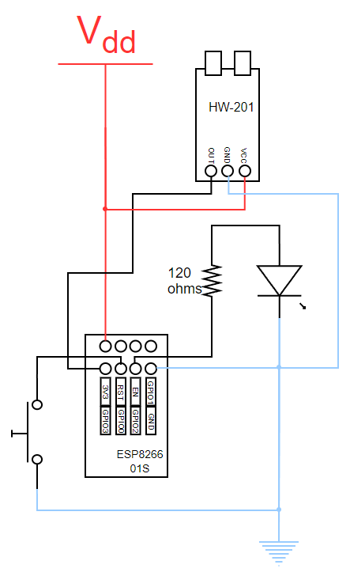

# Garage door alarm project details

This document describes the electronic construction of this project.

## Electronic componets

- 1x Esspresif ESP8266 01s.
- 1x HW-201 infrared obstacle detector.
- 1x pulse button.
- 1x LED.
- 1x resistor 10k ohms.
- 1x resistor 120 ohms.

## Electric diagram

## Prototype

For testing and viability purposes I built a full prototype that runs the garage door alarm and offers a good user experience. The prototype follows exactly the connections of the Electric diagram.
